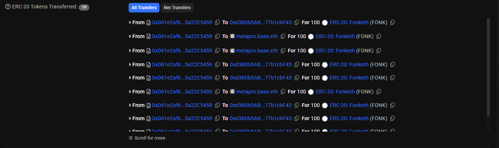

# Fonketh: Peer-to-Peer Protocol-Agnostic Mining Pool Layer

Poc Contract Live on **Base Chain**.


Contract Address at [0xd61e2af6a7c347713c478c4e9fef8fe5a22c5459](https://basescan.org/address/0xd61e2af6a7c347713c478c4e9fef8fe5a22c5459)

## Abstract

Traditional *Proof-of-Work* (PoW) protocols were originally designed around solo mining, where rewards go to whichever individual achieves the winning result first. As a consequence, miners with more efficient hardware capture a disproportionate share of rewards, causing smaller participants to **expend energy** without meaningful returns. This dynamic pushes the ecosystem toward ***centralization*** and mining ***monopolies*** over the time.

While mining pools mitigate some of this imbalance, they remain tightly coupled to specific blockchains or protocols. **FonkETH** introduces a protocol-agnostic *peer-to-peer* (P2P) networking layer that allows miners of any scale to *aggregate* their compute, coordinate work, and share *context-dependent* opportunities (e.g., miners with different capabilities or insights can contribute uniquely to the process). This approach enables **proportional reward distribution** among participants based on their actual contribution.

### How to Play
```bash
$ git clone https://github.com/Arvmor/fonketh.git
$ cd fonketh
$ cargo run -F interface --release
```

## Overview

Fonketh is essentially a **Peer-2-peer mining pool** / **`Gameified PoW Node`**

Allows nodes to join a decentralized mining pool and **compound their mining powers**.

The nodes are rewarded with `$FONK` tokens based on their mining power & contributions.

## Implementation

The implementation will be based on CoW Protocol's `Solvers` protocol (or any other protocol that supports mining).

Players will be actively processing CoW Protocols solver tasks _(under the hood of the game logic)_,

Gossiping the results to the network and broadcasting the claims on-chain,

Finally, getting rewarded based on their contributions.

<!-- image -->


-> [Claim Transaction Example](https://basescan.org/tx/0x38a361c7024107052d1c641c45c6273c639ba13cf3c997c6a1d5426dbdaf2370)

### Current Implementation

Currently, the implementation is based on `CREATE2` mining logic.

Players will be mining `CREATE2` addresses based on a given `Network Difficulty`

And gossiping their mined blocks to the network (every 10 blocks across the network).

(As writing this, the difficulty is < `0X000000FFFFFFFFFFFFFFFFFFFFFFFFFFFFFFFFFF`)

```rust
pub fn mine(&mut self, nonce: U256, init_hash: B256) -> Option<U256> {
    // Mine the address
    let salt = keccak256((nonce, self.address).abi_encode_packed());
    let mined = self.factory.create2(salt, init_hash);

    // If passed the network difficulty
    if mined < self.difficulty {
        info!("Mined address: {mined} with salt: {salt}");
        return Some(nonce);
    }

    None
}
```
